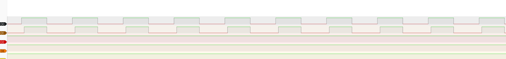
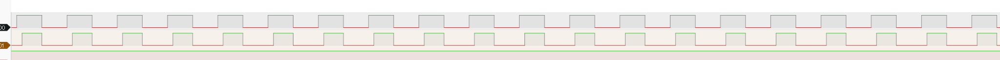
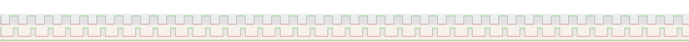

# Bring-up Procedure

## 目的
最低構成で「電気→光→電気」が成立した証拠（波形/写真/条件）と、初見でも30分で再現できる手順を残す（W3以降の設計判断を安定させる）。

---

## 0. 事前準備（共通）
### 0.1 必要機材
- マルチメータ（必須）
- ロジアナ（推奨。PulseView / Saleae Logic 等）
- PC（Thonny）

### 0.2 事前確認
- 部品の向き（Tx/Rx、TOSLINKの向き、ファイバの向き）
- ジャンパ線の刺さり（ブレッドボードが原因で接触不良が起きやすい）
- GND共有が取れていること（最優先）

---

## 1. 配線（最低構成）
### 1.1 Pico ↔ Tx/Rx（必須）
- 電源：Pico 3V3(OUT) → Tx VCC / Rx VCC（3.3Vレール扱い）
- GND：Pico GND → Tx GND / Rx GND（共通GND）
- 送信：Pico GP2 → Tx Vin
- 受信：Rx Vout → Pico GP3

補足
- プルダウン抵抗（例：220kΩ）は今回の構成では不要だった。入れるとGP3が常時0になり受信できない場合がある。

### 1.2 記録（必須）
- Photo: wiring_overview.jpg
- メモ：
  - ファイバ長：1 m
  - プル抵抗：なし（今回）
  - 電源：Pico 3V3(OUT)
  - 測定点：GP2 / GP3 / 3.3V

---

## 2. Phase 1: Power（電源）
### 2.1 通電前チェック（推奨）
- [×] 3.3Vレール - GND の抵抗を測る（短絡チェック）
- [×] 目視でショート/ブリッジがない

### 2.2 通電・電圧確認（必須）
- [×] Pico 3V3(OUT)（3.3Vレール）測定：3.3 V
- [×] Tx VCC 測定：3.3 V
- [×] Rx VCC 測定：3.3 V

測り方（最小）
- 黒プローブ：Pico GND
- 赤プローブ：3.3Vレール（または Tx/Rx の VCC ピン）

### 2.3 電源Bring-up（テスター）
測定手順（最小）
- DMMをDC電圧レンジに設定
- 黒リードを TP2（TP_GND）に当て続ける（基準点）
- 赤リードで各TPを測る

| TP（Reference/Value） | Net | 期待値（レンジ） | 判定/メモ |
| --- | --- | --- | --- |
| TP2（TP_GND） | GND | 0 V | 基準点。0 Vからずれる場合はGND接続を再確認 |
| TP1（TP_VBUS） | VBUS_IN | 4.75-5.25 V | USB 5 V入力。範囲内ならOK |
| TP4（TP_VBUS_PRO） | VBUS_PRO | 4.75-5.25 V | 保護後5 V。範囲内ならOK |
| TP3（TP_3V3） | 3V3 | 3.23-3.37 V | 3.3 Vレール。範囲内ならOK |

切り分けメモ
- TP1がOKでTP4がNGなら、F1（Polyfuse）周り（はんだ不良/部品不良/トレース）を疑う
- TP4がOKでTP3がNGなら、LDO（U1）周り（向き/はんだ/短絡/入出力コンデンサ）を疑う

---

## 3. Phase 2: MCU（Pico動作）
- [×] ThonnyでMicroPythonが実行できる（printが出る）
- [×] 使用GPIOが衝突していない（GP2/GP3/GP26など）

---

## 4. Phase 3: GPIO（電気の成立）
### 4.1 Tx（GP2）が出ていること
- [×] GP2を低速でトグル/PWMできる（最初は50Hz）

### 4.2 Rx（GP3）が読めること
- [×] GP3が入力として 0/1 を読み取れる

補足
- 受信が疑わしい場合は一度 Rx Vout を GP26(ADC) に繋いで、ON/OFFで電圧差が出るかを確認する（アナログ確認）。

---

## 5. Phase 4: Optical Link（電気→光→電気の成立）
### 5.1 FW（MicroPython / エッジカウント）
- GP2: PWM出力
- GP3: IRQ（RISING|FALLING）でエッジ数をカウント

期待値
- 50Hz → 100 edges/sec
- 100Hz → 200 edges/sec
- 200Hz → 400 edges/sec
- 400Hz → 800 edges/sec
- 500Hz → 1000 edges/sec

### 5.2 証拠（必須）
- ロジアナで GP2（Tx入力）と GP3（Rx出力）を同時観測し、スクショを残す
  - D0 = GP2
  - D1 = GP3

取得推奨
- OK例：100Hz（安定）
- OK例：200Hz（安定）
- 限界例：400Hz or 500Hz（マージン低下の例）

100Hz

200Hz

400Hz

500Hz

---

## 6. よくある失敗（NG集 / チェックリスト）
- 向き違い（Tx/Rx、ファイバ方向）
- GND共有が取れていない
- ブレッドボード接触不良（刺さりが浅い/同一列ミス）
- プルダウン抵抗で受信が潰れる（今回：220kΩでGP3が常時0になる）
- Tx側の配線不良（GP2→Tx Vin が外れている/刺さっていない）
